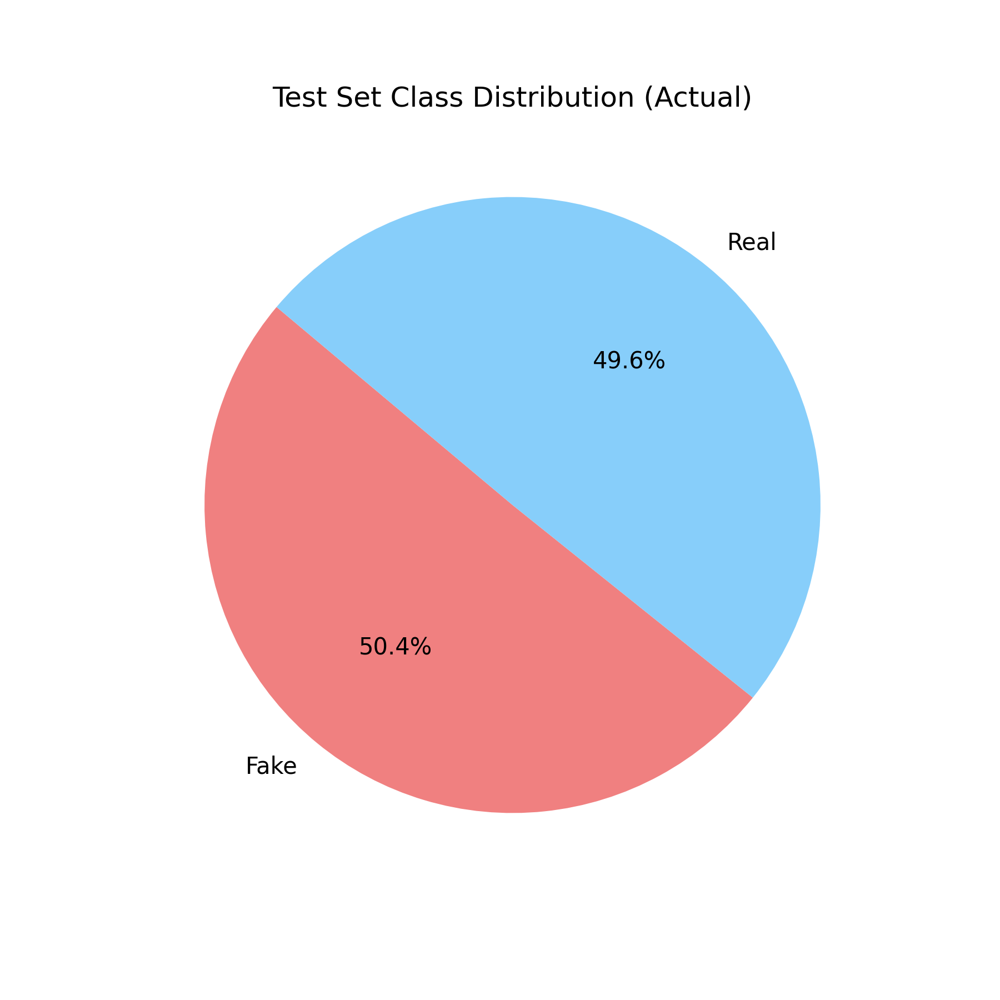
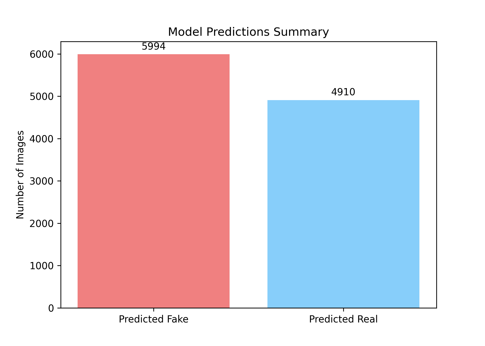

# DenseNet121 Deepfake Detector

This directory contains the implementation and trained weights for the DenseNet121 model used in the deepfake detection pipeline.

## Overview
- **Architecture**: DenseNet121 (pretrained on ImageNet, fine-tuned for binary classification: Fake vs Real)
- **Input Size**: `224 x 224` RGB Images
- **Training Epochs**: 2 Epochs

## How The Code Works (`densenet.py`)

The `densenet.py` script manages the entire lifecycle of the CNN model—from data loading to training, evaluating, and predicting.

### 1. Data Preparation (`get_dataloaders`)
The dataset is loaded using PyTorch's `datasets.ImageFolder`. Images are dynamically transformed during loading:
- Resized to `224x224` pixels.
- Converted to Tensors.
- Normalized using the standard ImageNet mean (`[0.485, 0.456, 0.406]`) and standard deviation (`[0.229, 0.224, 0.225]`), ensuring the pretrained weights function correctly on our data domain.

### 2. Model Definition (`DeepfakeDenseNet`)
We utilize `models.densenet121(pretrained=True)` to leverage transfer learning. The original DenseNet121 classifier (which classifies 1000 categories) is stripped and replaced. We attach a `nn.Sequential` block containing a `Dropout` layer (to prevent overfitting) and a `Linear` layer to output two distinct logits for our binary problem: Fake (0) and Real (1).

### 3. Training Loop & State Management
The model is trained using the Adam Optimizer and CrossEntropyLoss. 
Crucially, the code features **automated checkpointing**. At the end of every epoch, it saves the `model.state_dict()`, `optimizer.state_dict()`, and the `history` dictionary to `training_checkpoint.pth`. If the script is stopped and restarted, it will automatically load this checkpoint, preventing loss of training progress.

### 4. Evaluation & Metrics
After the training epochs complete, the model evaluates itself on an unseen test set. It calculates the True Positives, True Negatives, False Positives, and False Negatives, from which it derives:
- **Accuracy**: Overall correctness.
- **Precision**: When predicting "Real", how often it is actually Real.
- **Recall**: Out of all actual "Real" images, how many the model successfully found.
- **F1-Score**: The harmonic mean of precision and recall.

Finally, the script utilizes `matplotlib` to programmatically plot the loss curve, accuracy curve, confusion matrix, and class distribution, saving them as `.png` files in the directory.

### 5. Prediction Hook (`predict_image`)
This is the function called by the `main.py` pipeline. It accepts a raw image path, applies the exact same resizing/normalization transforms used in training, loads the `densenet.pth` weights, and performs a single forward pass under `torch.no_grad()`. It applies Softmax to the outputs to calculate a human-readable confidence percentage before returning the prediction to the main orchestrator.

## The Dataset

This model was trained on a robust deepfake dataset containing **190,334** total images.
- **Train Set**: `140,002` images
- **Validation Set**: `39,428` images
- **Test Set**: `10,904` images

## Final Results

After **2 epochs**, the DenseNet121 model achieved excellent results on the 10,904-image Test Set:
- **Test Accuracy**: `91.68%`
- **Precision**: `0.9589`
- **Recall**: `0.8698`
- **F1-Score**: `0.9121`

The DenseNet architecture effectively propagates features across layers, allowing it to accurately capture the subtle 2D spatial anomalies inherent to deepfake images.

### Visualizations
Below are the final evaluation charts generated by the script:

**Confusion Matrix**  

**Loss Curve**  

**Accuracy Curve**  

**Test Distribution Pie**  

**Predictions Summary**  

