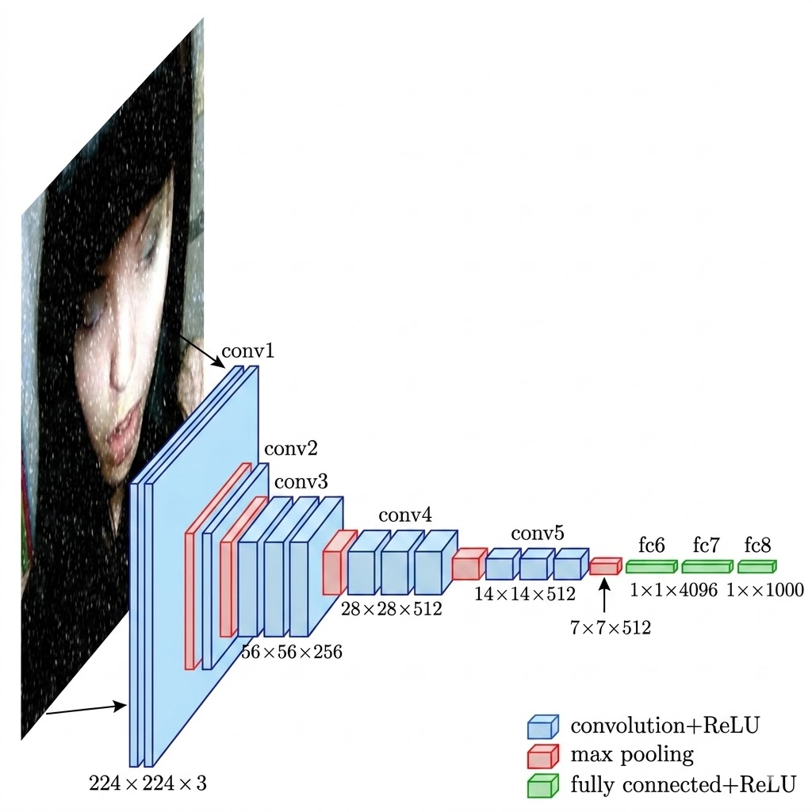
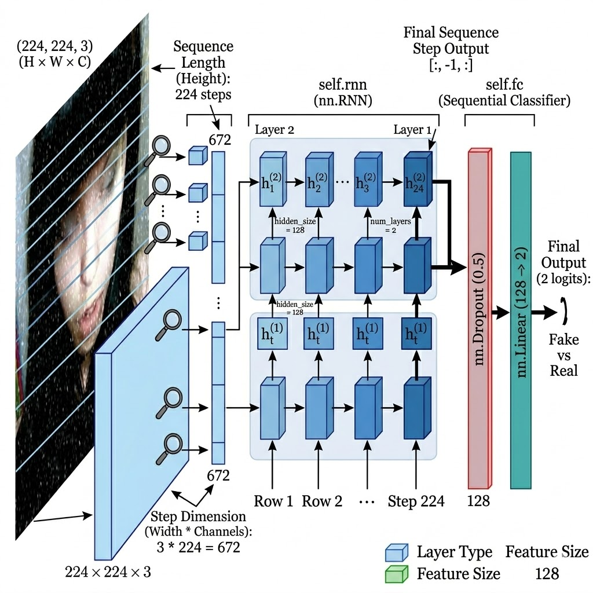
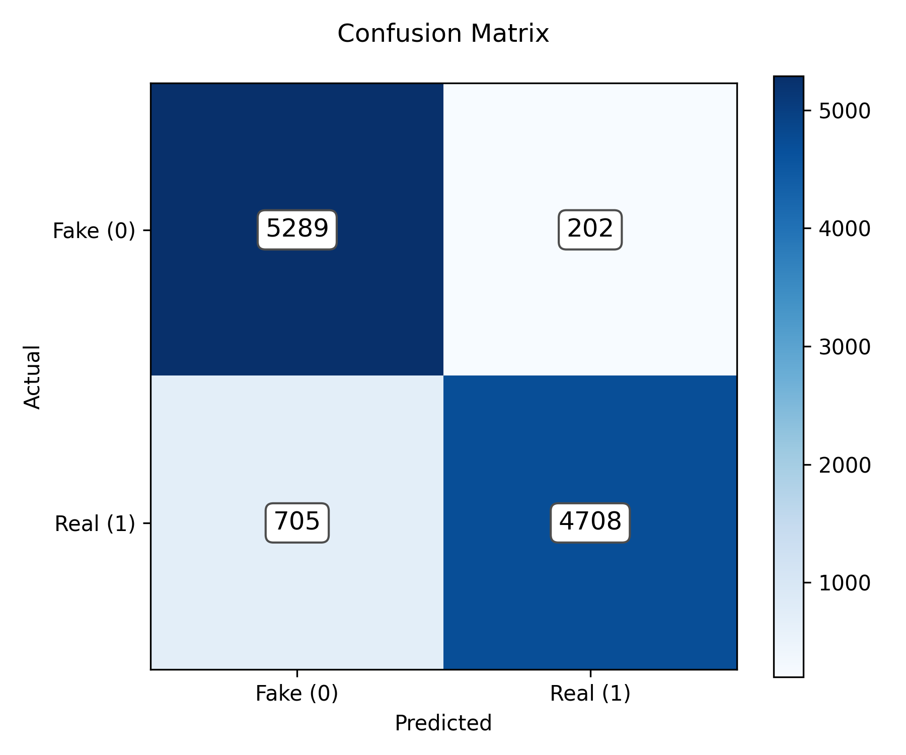
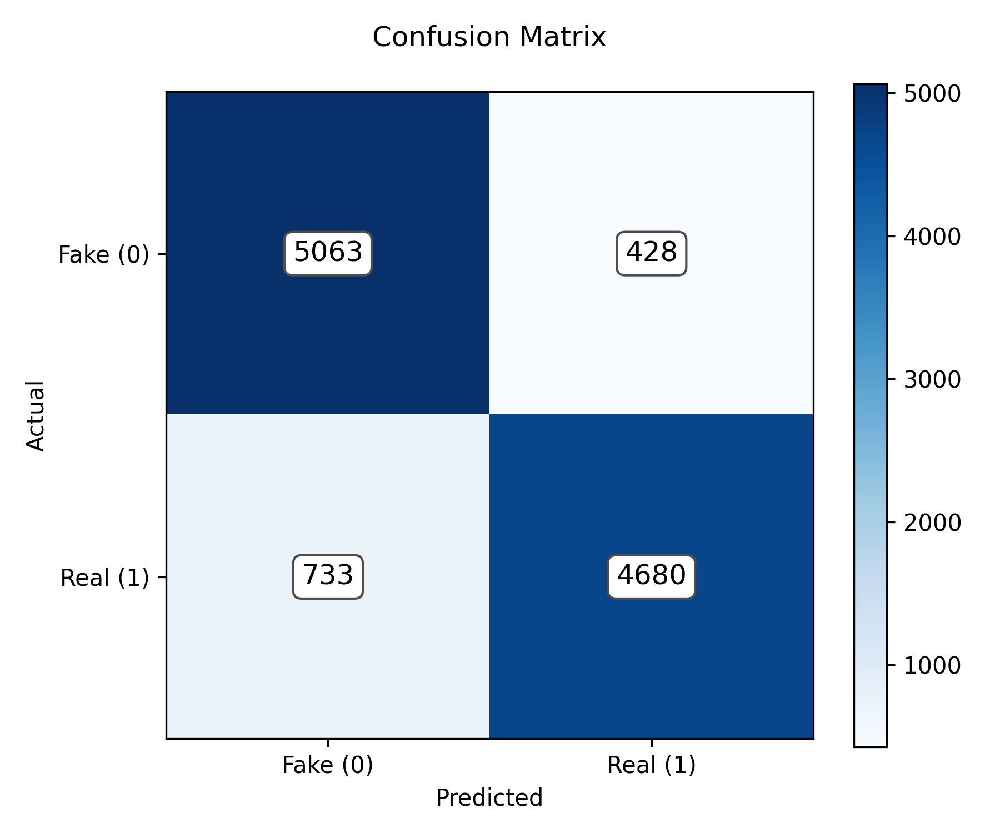
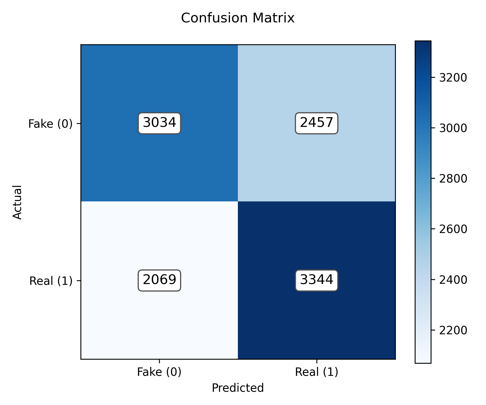

# Deepfake Detection System

This project is a comprehensive Deepfake Detection System that evaluates images to determine if they are authentic or artificially generated. It uses a combination of traditional digital forensics and advanced AI deep learning models.

## How The Pipeline Works

The system is orchestrated by the `main.py` script, which pipes a target image through a multi-step analysis workflow. The digital forensic tools are housed in `forensics.py`, while the AI models are modularized in their respective directories.

### 1. Metadata Analysis
*Code reference: `forensics.get_metadata()` and `forensics.analyze_metadata_anomaly()`*
The script extracts EXIF (Exchangeable Image File Format) data from the image. It looks for anomalies such as missing camera signatures, unnatural software tags (e.g., "Adobe Photoshop"), or stripped metadata. Deepfake generators often strip or alter EXIF data, making this a strong preliminary check.

### 2. Error Level Analysis (ELA)
*Code reference: `forensics.perform_ela()`*
ELA works by intentionally resaving the image at a known error rate (e.g., 90% JPEG quality) and computing the pixel-by-pixel difference between the original and the resaved version. In an authentic image, all areas should be at roughly the same compression level. If a face is spliced onto a body, the face and body will exhibit different compression error levels, which ELA visually highlights in the output map.

### 3. Blur Detection (Variance of Laplacian)
*Code reference: `forensics.blur_Detection()`*
The image is converted to grayscale and convolved with a Laplacian filter (a 2nd derivative edge detection operator). The script calculates the variance of the response. A low variance indicates a lack of sharp edges (high blur). Since deepfake generation (especially face-swapping) often involves smoothing and blending artifacts around the edges of the face, an unusually low blur score acts as a red flag.

### 4. Multi-AI Classification
*Code reference: `resnet50.predict_image()`, `rnn.predict_image()`, and `densenet.predict_image()`*
Instead of relying on a single architecture, the image tensor is passed through three distinct PyTorch neural networks:
- **Spatial AI (ResNet50)**: Evaluates the 2D spatial context.
- **Sequential AI (RNN)**: Evaluates the row-by-row sequence patterns.
- **Deep Feature AI (DenseNet121)**: Evaluates deep feature propagation and reuse.
The models output their confidence scores (Fake vs Real), offering a robust, multi-perspective conclusion.

## Architectures Used

### ResNet50 (Convolutional Neural Network)
ResNet50 is a powerful CNN featuring residual connections that prevent the vanishing gradient problem. It excels at extracting spatial features (like mismatched skin tones or strange lighting).


### DenseNet121 (Dense Convolutional Network)
DenseNet121 is a specialized architecture where each layer connects to every other layer in a feed-forward fashion. It encourages feature reuse and alleviates the vanishing-gradient problem, making it highly effective for deepfake detection.

### RNN (Recurrent Neural Network)
To approach the problem from a sequential angle, we implemented an RNN. This model reshapes the image and processes it sequentially (row by row) to find inconsistencies in the progression of pixel patterns.


## The Dataset

The models were trained and evaluated on a massive custom dataset comprising **190,334 total images**, evenly split between `Fake` and `Real` classes to prevent class imbalance. 

The dataset is partitioned into three distinct sets:
- **Train Set**: `140,002` images (Used to train the network weights)
- **Validation Set**: `39,428` images (Used to evaluate and tune the model after every epoch)
- **Test Set**: `10,904` images (The final holdout set used to generate the concluding metrics below)

## Model Comparison & Results

We evaluated all architectures on the exact same 10,904-image Test Set. The results yielded a clear winner regarding which architecture is better suited for standard deepfake artifact detection.

### DenseNet121 Results (2 Epochs)
- **Test Accuracy**: **91.68%**
- **F1-Score**: **0.9121**
- **Analysis**: DenseNet121 achieved the best performance out of all models in only 2 epochs. Its architecture effectively propagates features across layers, allowing it to accurately capture the subtle 2D spatial anomalies inherent to deepfake images better than traditional CNNs.


### ResNet50 Results (10 Epochs)
- **Test Accuracy**: **89.35%**
- **F1-Score**: **0.8896**
- **Analysis**: The ResNet50 model performed exceptionally well, achieving near 90% accuracy in just 10 epochs. Because CNNs natively process the 2D spatial relationships of pixels, ResNet50 is incredibly effective at identifying the localized spatial artifacts (like weird blending lines or mismatched textures) typical of deepfakes.


### RNN Results (100 Epochs)
- **Test Accuracy**: **58.49%**
- **F1-Score**: **0.5964**
- **Analysis**: Even after 100 epochs, the RNN struggled to generalize, hovering only slightly above random guessing (58%). This illustrates a key computer vision principle: forcing a sequential model (RNN) to read a 2D image row-by-row strips away the vertical spatial context. Deepfake artifacts are inherently spatial 2D anomalies, making the RNN poorly suited for this specific task compared to a CNN.


## Usage

To run the full pipeline on an image:
```bash
python main.py
```
You will be prompted to enter the path to the image you want to analyze. The system will output the forensic analysis and the prediction results from the ResNet50, DenseNet121, and RNN models. Outputs and visualizations (like the ELA map) will be saved in the `results/` folder.
