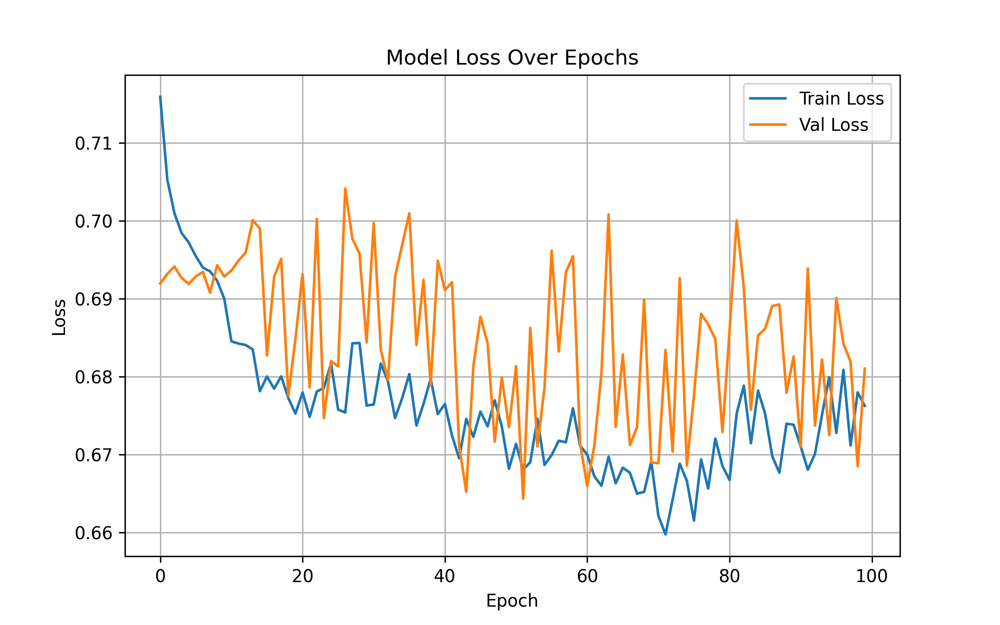
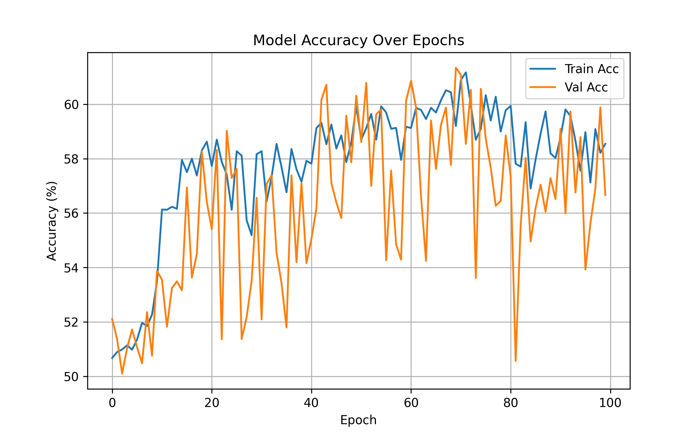

# RNN Deepfake Detector (100 Epochs)

This directory contains the implementation and trained weights for the Recurrent Neural Network (RNN) model used in the deepfake detection pipeline.

## Overview
- **Architecture**: 2-Layer Recurrent Neural Network (RNN) with a hidden size of 128 and 50% Dropout.
- **Input Processing**: Images are resized to `224 x 224` and processed as a sequence of 224 steps. Each sequence step reads one row of the image (containing 672 features from the `224 * 3` RGB channels).
- **Training Epochs**: 100 Epochs

## How The Code Works (`rnn.py`)

While Convolutional Neural Networks (CNNs) are standard for image tasks, this script implements a Recurrent Neural Network to analyze image data sequentially. 

### 1. Data Transformation
Images are loaded via `ImageFolder` and resized to `224x224`. After standard RGB normalization, the data shape of a single image batch is `[Batch Size, 3, 224, 224]`. 

### 2. The RNN Architecture (`DeepfakeRNN`)
Because an RNN requires a sequence (like time-series data or words in a sentence), we must reshape the image tensor inside the `forward` pass:
```python
x = x.view(batch_size, 224, -1)
```
This flattens the channels and width together. The resulting shape is `[Batch Size, 224, 672]`. 
- **Sequence Length**: `224` (The model reads the image from the top row to the bottom row, taking 224 steps).
- **Input Features**: `672` (3 color channels * 224 pixels of width per row).

This sequence is fed into a 2-layer `nn.RNN` module. As the RNN processes each row, it updates its "hidden state" (context).

### 3. Classification
When the RNN reaches the final row of the image (the end of the sequence), its hidden state theoretically contains the accumulated understanding of the entire image. The script extracts the output of this final sequence step (`out[:, -1, :]`) and passes it through a dense Linear layer with a 50% dropout rate. This layer squashes the 128 hidden state features into 2 logits (Fake vs Real).

### 4. Training and Checkpointing
The model trains using Adam and CrossEntropyLoss. Due to the high number of epochs (100), the automated checkpointing system is critical. After every epoch, `training_checkpoint.pth` is overwritten with the latest weights and optimizer states. If the training fails on epoch 85, restarting the script will automatically resume from epoch 85 rather than starting over from 0.

### 5. Evaluation & Matplotlib Visuals
Once the 100 epochs are finished, the script evaluates the test dataset. It manually computes the confusion matrix variables (TP, TN, FP, FN) and logs the Precision, Recall, and F1-Scores. Using `matplotlib`, it generates comprehensive graphs (Loss curves, Accuracy curves, Distribution Pie Charts, and Bar Charts) so the researcher can visually verify the health and convergence of the 100-epoch training run.

### 6. Main Pipeline Integration (`predict_image`)
When `main.py` runs, it calls this script's `predict_image()` method. The method loads the `rnn.pth` weights, processes the incoming raw image into a sequence tensor, evaluates it through the RNN, and applies a Softmax function to translate the raw logits into a percentage-based confidence score.

## The Dataset

This model was trained on a robust deepfake dataset containing **190,334** total images.
- **Train Set**: `140,002` images
- **Validation Set**: `39,428` images
- **Test Set**: `10,904` images

## Final Results

After **100 epochs**, the RNN model achieved the following results on the 10,904-image Test Set:
- **Test Accuracy**: `58.49%`
- **Precision**: `0.5765`
- **Recall**: `0.6178`
- **F1-Score**: `0.5964`

Unlike the CNN (which hit 89% in just 10 epochs), the RNN struggled significantly. By flattening the 2D image into 1D sequences, the model lost all vertical spatial context. Because deepfake generation artifacts (such as facial blending edges) heavily rely on 2D relationships between pixels, the RNN could not effectively learn to spot them, remaining only slightly better than random chance.

### Visualizations
Below are the final evaluation charts generated by the script:

**Confusion Matrix**  


**Loss Curve**  


**Accuracy Curve**  

